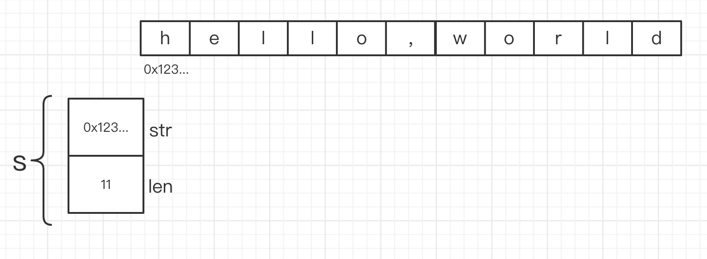

## 字符串
### Unicode vs UTF-8
- Unicode收集了这个世界上所有的符号系统，包括重音符号和其它变音符号，制表符和回车符，还有很多神秘的符号，每个符号都分配一个唯一的Unicode码点，Unicode码点对应Go语言中的rune整数类型。
- UTF8是一个将Unicode码点编码为字节序列的变长编码,UTF8编码使用1到4个字节来表示每个Unicode码点，ASCII部分字符只使用1个字节，常用字符部分使用2或3个字节表示
- unicode/utf8包则提供了用于rune字符序列的UTF8编码和解码的功能

### 字符串
- 字符串可以为空（长度为0），但不会是nil
- 字符串底层是一个不可改变的字节序列。
- 字符串是Unicode兼容的，并且是UTF-8编码的
### 字符串数据结构
源码包src/runtime/string.go:stringStruct定义了string的数据结构：
```go
type stringStruct struct {
	str unsafe.Pointer  //字符串的首地址
	len int  //字符串的长度
}
```
### 字符串内存结构
```go
s:="hello, world"
```


###  字符串和Byte切片

####  []byte转string
```go
package main

import "fmt"

func main() {
	b := []byte{'h', 'e', '1', 'l', 'o'}
	s := string(b)
	fmt.Println(s) // "hello"
}
```

#### string转[]byte
```go
package main

import "fmt"

func main() {
	s := "hello"
	b := []byte(s)
	fmt.Println(b) // [104 101 108 108 111]
}
```

### 字符串和数字的转换
#### 数字转字符串
1. 用fmt.Sprintf返回一个格式化的字符串
```go
package main

import (
	"fmt"
)

func main() {
	i := 123
	str := fmt.Sprintf("%d", i)
	fmt.Println(str) // "123"
}
```
2. 另一个方法是用strconv包里面的strconv.Itoa(“整数到ASCII”)函数
```go
package main

import (
	"fmt"
	"strconv"
)

func main() {
	i := 123
	str := strconv.Itoa(i)
	fmt.Println(str) // "123"
}
```
#### 字符串转数字
用strconv包里面的strconv.Atoi(“ASCII到整数”)函数
```go
package main

import (
	"fmt"
	"strconv"
)

func main() {
	str := "123"
	i, _ := strconv.Atoi(str)
	fmt.Println(i) // 123
}
```

### 字符串拼接
1. 使用“+”连接
```go
package main

import (
	"fmt"
)

func main() {
	str := "hello, " + "world"
	fmt.Println(str) // "hello,world"
}
```
golang里面的字符串都是不可变的，每次运算都会产生一个新的字符串.所以使用运算符"+"连接字符串会产生很多临时的无用的字符串,会给 gc 带来额外的负担，性能比较差
2. 使用fmt.Sprintf
```go
package main

import (
	"fmt"
)

func main() {
	str := fmt.Sprintf("%s,%s", "hello", "world")
	fmt.Println(str) // "hello,world"
}
```
这种方式,使用简单,虽然不会像"+"连接那样生成多余的string,但是内部实现颇为复杂,性能不是很好
3. 使用strings.Join
```go
package main

import (
	"fmt"
	"strings"
)

func main() {
	s := []string{"hello", "world"}
	str := strings.Join(s, ",")
	fmt.Println(str) // "hello,world"
}
```
这种方式实现字符串的拼接,简单方便,效率也是很高的,建议使用,唯一的不足就是在生成数组的时候开销比较大
4. 使用bytes.Buffer
```go
package main

import (
	"bytes"
	"fmt"
)

func main() {
	var buf bytes.Buffer
	buf.WriteString("hello")
	buf.WriteString(",")
	buf.WriteString("world")
	fmt.Println(buf.String()) // "hello,world"
}
```
这个比较理想，可以当成可变字符使用，对内存的增长也有优化，如果能预估字符串的长度，还可以用 buffer.Grow() 接口来设置 capacity。
5. 使用strings.Builder
```go
	package main

import (
	"fmt"
	"strings"
)

func main() {
	var buf strings.Builder
	buf.WriteString("hello")
	buf.WriteString(",")
	buf.WriteString("world")
	fmt.Println(buf.String()) // "hello,world"
}
```
strings.Builder 内部通过 slice 来保存和管理内容。slice 内部则是通过一个指针指向实际保存内容的数组。
strings.Builder 同样也提供了 Grow() 来支持预定义容量。
当我们可以预定义我们需要使用的容量时，strings.Builder 就能避免扩容而创建新的 slice 了。strings.Builder是非线程安全，性能上和 bytes.Buffer 相差无几